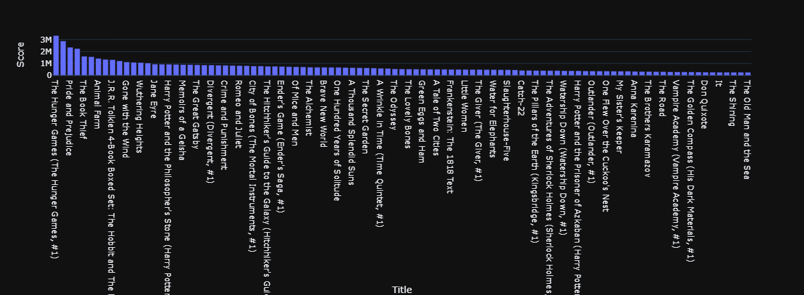

# Scraping-Best-Books-Ever
Creating a database of best books ever and making inferences from [www.goodreads.com](https://www.goodreads.com/list/show/1.Best_Books_Ever)


## Table of Contents
* [General Info](#general-information)
* [Libraries Used](#libraries-used)
* [Improvements](#improvements)
* [Screenshots](#screenshots)
* [Setup](#setup)
* [Project Status](#project-status)


## General Information
From the data scraped, you can make conclusions for the books based on votes, average ratings and scores given by people.  

## Libraries Used
- lxml - version 4.9.1
- beautifulsoup4 - version 4.11.1
- pandas - version 1.4.3
- requests - version 2.28.1
- regex - version 2022.9.13
- plotly - version 5.10.0


## Improvements
This project has one-liners: concise statements of useful functionality packed into a single line of code.  
Example:
```diff
- scores = []
- for i in range(len(booksCards)):
-     x = booksCards[i].find('div', style = "margin-top: 5px").a.text[7:]
-     y = re.sub(",", "", x)
-     scores.append(int(y))
+ scores = [int(re.sub(",", "", booksCards[i].find('div', style = "margin-top: 5px").a.text[7:])) for i in range(len(booksCards))]
```

## Screenshots


## Setup
Requirents for this project are the libraries listed above.  
To install these libraries to your local environment run the following installation commands in you terminal;
- `pip3 install lxml`
- `pip3 install beautifulsoup4`
- `pip3 install pandas`
- `pip3 install requests`
- `pip3 install regex`
- `pip3 install plotly`

## Project Status
Project is: _in progress_  

